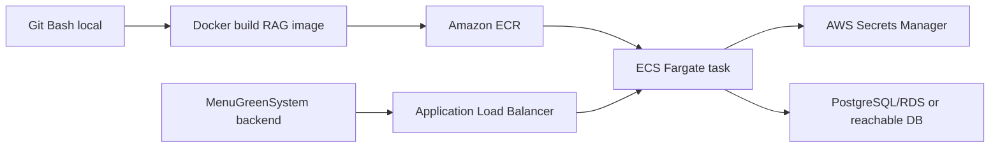

# RAG AWS Deploy Runbook

Ngay deploy: 2026-07-08

Pham vi: chi deploy `RAG_AI_MenuGreen`. `MenuGreenSystem` do nguoi khac deploy, ben System chi can biet URL worker va internal key sau khi RAG len AWS.

## Ket luan nhanh

- Huong deploy phu hop nhat hien tai: Docker image -> Amazon ECR -> Amazon ECS Fargate -> Application Load Balancer.
- Ly do: repo da co `Dockerfile`, da co CloudFormation ECS Fargate, runtime FastAPI can ONNX + secret DB/Gemini/key, khong can quan ly server EC2 thu cong.
- ONNX da san sang deploy: `runtime/models/intent_onnx/model.int8.onnx` co trong repo va Dockerfile copy vao image.
- Model fp32 `model.onnx` dang bi loai khoi Docker image de giam size. Runtime uu tien int8 nen deploy van OK.
- Chua nen bam deploy tu may hien tai cho toi khi:
  - AWS CLI chua cai trong PATH.
  - Docker Desktop daemon chua chay.

## Trang thai da kiem tra tren may nay

- Git repo RAG dang sach truoc khi them file runbook nay.
- Git Bash co san tai `C:\Program Files\Git\bin\bash.exe`.
- Lenh `bash` mac dinh tren PATH dang tro WSL va bi loi `/bin/bash` khong ton tai. Neu terminal bash bi loi, mo Git Bash hoac goi full path Git Bash.
- `python -m compileall runtime/app` pass.
- `.venv/Scripts/python.exe -m pytest tests -q` pass: `22 passed`.
- Docker CLI co cai, nhung Docker daemon chua chay.
- AWS CLI chua cai.

## Tai lieu AWS chinh thuc da doi chieu

- ECS la dich vu container managed de deploy, quan ly va scale containerized applications:
  https://docs.aws.amazon.com/AmazonECS/latest/developerguide/Welcome.html
- Fargate chay container tren ECS ma khong can quan ly EC2 instances:
  https://docs.aws.amazon.com/AmazonECS/latest/developerguide/AWS_Fargate.html
- ECS nen lay secret tu Secrets Manager hoac Systems Manager Parameter Store thay vi hardcode env:
  https://docs.aws.amazon.com/AmazonECS/latest/developerguide/specifying-sensitive-data.html
- ECS task co the nhan Secrets Manager secret thanh environment variable:
  https://docs.aws.amazon.com/AmazonECS/latest/developerguide/secrets-envvar-secrets-manager.html

## Architecture muc tieu



## AWS quyen can co

Account/role ban duoc cap can co quyen:

- `sts:GetCallerIdentity`
- `ecr:*` toi thieu create repository, login, push image
- `ecs:*` cho cluster/service/task definition
- `cloudformation:*` cho deploy stack
- `iam:CreateRole`, `iam:AttachRolePolicy`, `iam:PutRolePolicy`, `iam:PassRole`
- `elasticloadbalancing:*`
- `ec2:Describe*`, tao security group/ingress rule
- `logs:*` cho CloudWatch log group
- `secretsmanager:*` cho tao va doc secret
- `kms:Decrypt` neu secret dung custom KMS key

## Chuan bi local

Neu dung Windows + Git Bash:

```bash
cd /d/EXE/RAG_AI_MenuGreen
```

Neu goi tu PowerShell ma `bash` loi, dung:

```powershell
& "C:\Program Files\Git\bin\bash.exe" -lc "cd /d/EXE/RAG_AI_MenuGreen && pwd"
```

Cai AWS CLI neu chua co:

```powershell
winget install -e --id Amazon.AWSCLI
```

Sau khi cai, dong terminal va mo lai:

```bash
aws --version
docker --version
docker info
```

Neu `docker info` loi, mo Docker Desktop va doi den khi daemon ready.

## Cau hinh AWS account

Khong paste access key/secret key vao chat. Cau hinh truc tiep tren may:

Neu ban duoc cap access key:

```bash
aws configure --profile menugreen-rag
export AWS_PROFILE=menugreen-rag
export AWS_REGION=ap-southeast-1
aws sts get-caller-identity
export AWS_ACCOUNT_ID="$(aws sts get-caller-identity --query Account --output text)"
echo "$AWS_ACCOUNT_ID"
```

Neu ban duoc cap AWS SSO:

```bash
aws configure sso --profile menugreen-rag
aws sso login --profile menugreen-rag
export AWS_PROFILE=menugreen-rag
export AWS_REGION=ap-southeast-1
aws sts get-caller-identity
export AWS_ACCOUNT_ID="$(aws sts get-caller-identity --query Account --output text)"
```

Region de xuat: `ap-southeast-1` Singapore.

## Chon VPC va subnet

Xem VPC:

```bash
aws ec2 describe-vpcs \
  --region "$AWS_REGION" \
  --query "Vpcs[*].[VpcId,IsDefault,CidrBlock]" \
  --output table
```

Chon VPC:

```bash
export VPC_ID="vpc-xxxxxxxx"
```

Xem subnet:

```bash
aws ec2 describe-subnets \
  --region "$AWS_REGION" \
  --filters "Name=vpc-id,Values=$VPC_ID" \
  --query "Subnets[*].[SubnetId,AvailabilityZone,MapPublicIpOnLaunch,CidrBlock]" \
  --output table
```

Cho deploy nhanh, chon 2 public subnets khac AZ va set:

```bash
export ALB_SUBNETS="subnet-aaaaaaaa,subnet-bbbbbbbb"
export SERVICE_SUBNETS="subnet-aaaaaaaa,subnet-bbbbbbbb"
export ASSIGN_PUBLIC_IP="ENABLED"
```

Neu service nam private subnet thi can NAT Gateway hoac VPC endpoints de ECS pull image va goi Gemini/API ngoai. De tranh fail lan dau, nen deploy smoke bang public subnets truoc.

## Tao Secrets Manager secrets

Can 3 secret chinh:

- `POSTGRES_URL`
- `GOOGLE_API_KEY` hoac `GOOGLE_API_KEYS`
- `AI_RUNTIME_INTERNAL_KEY`

Tao/cap nhat Postgres URL:

```bash
read -rsp "POSTGRES_URL: " POSTGRES_URL
echo
aws secretsmanager create-secret \
  --region "$AWS_REGION" \
  --name menugreen/rag/postgres-url \
  --secret-string "$POSTGRES_URL" \
  || aws secretsmanager put-secret-value \
    --region "$AWS_REGION" \
    --secret-id menugreen/rag/postgres-url \
    --secret-string "$POSTGRES_URL"
```

Tao/cap nhat Gemini key:

```bash
read -rsp "GOOGLE_API_KEY: " GOOGLE_API_KEY
echo
aws secretsmanager create-secret \
  --region "$AWS_REGION" \
  --name menugreen/rag/google-api-key \
  --secret-string "$GOOGLE_API_KEY" \
  || aws secretsmanager put-secret-value \
    --region "$AWS_REGION" \
    --secret-id menugreen/rag/google-api-key \
    --secret-string "$GOOGLE_API_KEY"
```

Tao internal key:

```bash
export AI_RUNTIME_INTERNAL_KEY="$(python -c 'import secrets; print(secrets.token_urlsafe(48))')"
echo "Internal key da tao, hay luu vao password manager/devops secret store."
aws secretsmanager create-secret \
  --region "$AWS_REGION" \
  --name menugreen/rag/internal-key \
  --secret-string "$AI_RUNTIME_INTERNAL_KEY" \
  || aws secretsmanager put-secret-value \
    --region "$AWS_REGION" \
    --secret-id menugreen/rag/internal-key \
    --secret-string "$AI_RUNTIME_INTERNAL_KEY"
```

Lay ARN:

```bash
export POSTGRES_URL_SECRET_ARN="$(aws secretsmanager describe-secret --region "$AWS_REGION" --secret-id menugreen/rag/postgres-url --query ARN --output text)"
export GOOGLE_API_KEY_SECRET_ARN="$(aws secretsmanager describe-secret --region "$AWS_REGION" --secret-id menugreen/rag/google-api-key --query ARN --output text)"
export AI_RUNTIME_INTERNAL_KEY_SECRET_ARN="$(aws secretsmanager describe-secret --region "$AWS_REGION" --secret-id menugreen/rag/internal-key --query ARN --output text)"
```

## Tao file deploy env

```bash
cp infra/aws/rag-aws.env.example infra/aws/rag-aws.env
notepad infra/aws/rag-aws.env
```

Gia tri can dien:

```bash
export AWS_REGION=ap-southeast-1
export AWS_ACCOUNT_ID=<account-id-tu-sts>
export STACK_NAME=menugreen-rag-prod
export PROJECT_NAME=menugreen-rag
export ENVIRONMENT_NAME=prod
export ECR_REPO_NAME=menugreen-rag-runtime
export IMAGE_TAG=prod-$(date +%Y%m%d-%H%M%S)

export VPC_ID=<vpc-id>
export ALB_SUBNETS=<subnet-a>,<subnet-b>
export SERVICE_SUBNETS=<subnet-a>,<subnet-b>
export ASSIGN_PUBLIC_IP=ENABLED
export ALLOWED_INGRESS_CIDR=0.0.0.0/0

export POSTGRES_URL_SECRET_ARN=<arn>
export GOOGLE_API_KEY_SECRET_ARN=<arn>
export GOOGLE_API_KEYS_SECRET_ARN=
export AI_RUNTIME_INTERNAL_KEY_SECRET_ARN=<arn>

export DESIRED_COUNT=1
export TASK_CPU=1024
export TASK_MEMORY=2048
export CONTAINER_PORT=8000
export SERVE_FRONTEND=false
export INTENT_MODEL_DIR=models/intent_onnx
```

Khong commit `infra/aws/rag-aws.env`.

## Preflight truoc deploy

```bash
cd /d/EXE/RAG_AI_MenuGreen
python -m compileall runtime/app
.venv/Scripts/python.exe -m pytest tests -q

aws cloudformation validate-template \
  --region "$AWS_REGION" \
  --template-body file://infra/aws/templates/rag-ecs-fargate.yaml
```

Neu Docker da chay, co the build local truoc:

```bash
docker build -t menugreen-rag-runtime:local .
```

## Deploy

```bash
cd /d/EXE/RAG_AI_MenuGreen
source infra/aws/rag-aws.env
bash infra/aws/scripts/deploy_stack.sh
```

Script se:

1. Tao ECR repo neu chua co.
2. Docker build image tu root repo.
3. Push image len ECR.
4. Deploy/update CloudFormation stack.
5. In outputs gom ALB DNS va ServiceUrl.

## Verify sau deploy

Lay ServiceUrl:

```bash
export SERVICE_URL="$(aws cloudformation describe-stacks \
  --region "$AWS_REGION" \
  --stack-name "$STACK_NAME" \
  --query "Stacks[0].Outputs[?OutputKey=='ServiceUrl'].OutputValue" \
  --output text)"
echo "$SERVICE_URL"
```

Health check khong can key:

```bash
curl -s "$SERVICE_URL/health"
```

Expected:

```json
{"status":"ok","service":"runtime"}
```

Smoke chat can key:

```bash
export AI_RUNTIME_INTERNAL_KEY="$(aws secretsmanager get-secret-value \
  --region "$AWS_REGION" \
  --secret-id menugreen/rag/internal-key \
  --query SecretString \
  --output text)"

curl -s -X POST "$SERVICE_URL/worker/chat" \
  -H "Content-Type: application/json" \
  -H "X-AI-Runtime-Key: $AI_RUNTIME_INTERNAL_KEY" \
  --data '{
    "user_id": "deploy-smoke-user",
    "message": "Hom nay toi can nap bao nhieu calo?",
    "subscription_tier": "premium",
    "context": {
      "user_profile": {
        "height_cm": 170,
        "weight_kg": 70,
        "age": 28,
        "gender": "male",
        "activity_level": "moderate",
        "goal": "lose_weight"
      },
      "health_profile": {
        "height_cm": 170,
        "weight_kg": 70,
        "age": 28,
        "gender": "male",
        "activity_level": "moderate",
        "goal": "lose_weight"
      },
      "actual_intake_today": {
        "calories": 500
      }
    }
  }'
```

Recommendation smoke:

```bash
curl -s -X POST "$SERVICE_URL/api/ai/recommendations/safe" \
  -H "Content-Type: application/json" \
  -H "X-AI-Runtime-Key: $AI_RUNTIME_INTERNAL_KEY" \
  --data '{
    "user_id": "deploy-smoke-user",
    "date": "2026-07-08",
    "budget_vnd": 80000,
    "meal_slot": "lunch",
    "max_cook_time_min": 30,
    "target_calories": 600,
    "limit": 5
  }'
```

## Logs va troubleshoot

Tail logs:

```bash
aws logs tail "/ecs/${PROJECT_NAME}/${ENVIRONMENT_NAME}" \
  --region "$AWS_REGION" \
  --follow
```

Xem ECS service:

```bash
aws ecs describe-services \
  --region "$AWS_REGION" \
  --cluster "${PROJECT_NAME}-${ENVIRONMENT_NAME}" \
  --services "${PROJECT_NAME}-${ENVIRONMENT_NAME}" \
  --output table
```

Neu task bi restart:

- Kiem tra CloudWatch logs truoc.
- Kiem tra `POSTGRES_URL` co dung va DB cho connect tu ECS khong.
- Kiem tra security group DB co mo 5432 cho ECS service SG khong.
- Kiem tra subnets co internet/NAT neu can goi Gemini.
- Kiem tra secret ARN co dung region/account khong.

## Link voi MenuGreenSystem

Sau khi RAG verify OK, dua cho ban deploy System:

- `NutritionAssistant__WorkerUrl=$SERVICE_URL/worker/chat`
- `NutritionAssistant__WorkerInternalKey=$AI_RUNTIME_INTERNAL_KEY`

Neu System setting dung JSON:

```json
{
  "NutritionAssistant": {
    "WorkerUrl": "https://<rag-alb-or-domain>/worker/chat",
    "WorkerInternalKey": "<same-internal-key>"
  }
}
```

System da co code gui header `X-AI-Runtime-Key` neu `NutritionAssistant:WorkerInternalKey` hoac `AI_RUNTIME_INTERNAL_KEY` duoc set.

## Hardening sau smoke

- Bat HTTPS bang ACM certificate va set `ACM_CERTIFICATE_ARN`.
- Tro Route53/domain rieng vao ALB.
- Gioi han `ALLOWED_INGRESS_CIDR` neu biet IP outbound cua System.
- Can nhac doi ALB thanh internal ALB neu System cung nam trong AWS/VPC.
- Them WAF/rate limit neu ALB public.
- Set CloudWatch alarm cho ECS unhealthy task, ALB 5xx, CPU/memory.
- Khong log secret, khong commit `.env` hay `infra/aws/rag-aws.env`.

## Khi nao can sua template

- Neu Secrets Manager dung custom KMS key: bo sung KMS key ARN vao policy `kms:Decrypt`.
- Neu muon autoscaling: them ECS Service Auto Scaling policy.
- Neu muon private subnets: set `ASSIGN_PUBLIC_IP=DISABLED`, them NAT Gateway hoac VPC endpoints.
- Neu muon fp32 ONNX fallback trong image: bo dong `runtime/models/intent_onnx/model.onnx` khoi `.dockerignore`, chap nhan image lon hon.
